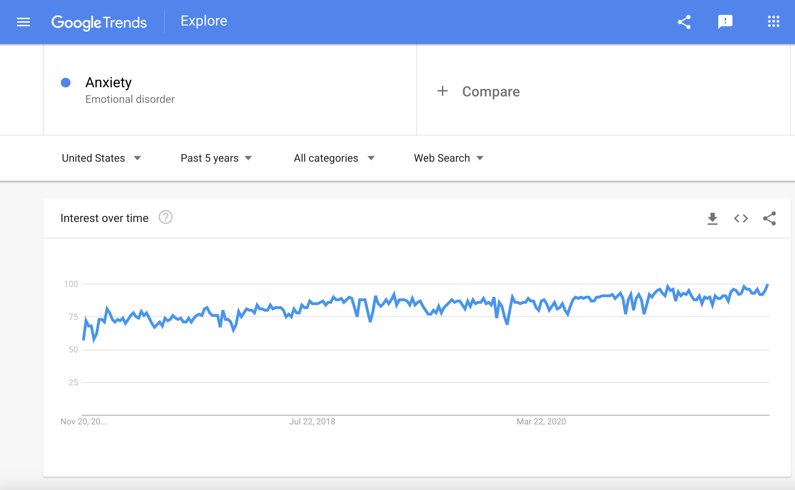
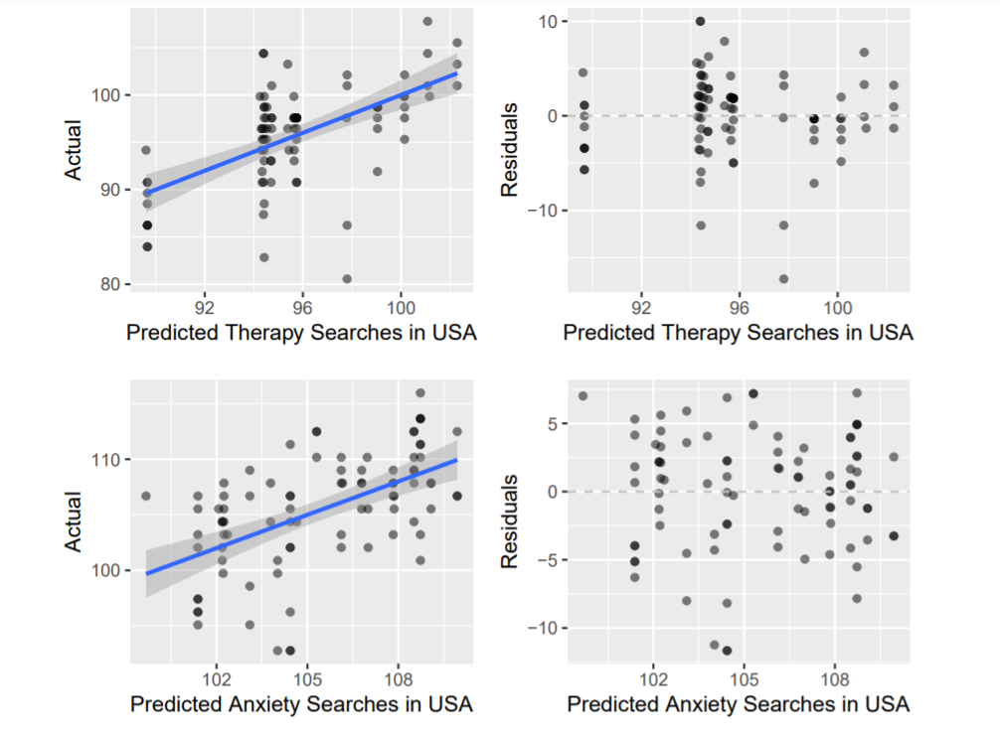

```{r load-packages, include = FALSE}
# Add any additional packages you need to this chunk
# Remove any packages from this list that you're not using
library(tidyverse)
library(tidymodels)
library(palmerpenguins)
library(knitr)
library(xaringanthemer)

library(readxl)
library(lubridate)
library(xtable)
```

```{r setup, include=FALSE}
# For better figure resolution
knitr::opts_chunk$set(
  fig.retina = 3, 
  dpi = 300, 
  fig.width = 6, 
  fig.asp = 0.618, 
  out.width = "70%"
  )
```

```{r load-data, include=FALSE}
setwd('../')
restrictions_worldwide <- readr::read_csv("data/phsm-severity-data-short.csv")
google_trends <- readr::read_csv("data/google_trends_data_c.csv")
```

```{r clean-data, echo=FALSE}
# for each dataset, make the countries standardized
restrictions_worldwide$COUNTRY <- gsub("United States Of America", "United States", restrictions_worldwide$COUNTRY)

restrictions_worldwide$COUNTRY <- gsub("United Kingdom Of Great Britain And Northern Ireland", "United Kingdom", restrictions_worldwide$COUNTRY)


google_trends <- 
  google_trends %>%
  mutate(COUNTRY = nation) %>%
  mutate(DATE_START = week)


match_dates<-merge(restrictions_worldwide, google_trends, by=c("COUNTRY","DATE_START")) 

new_set <- 
  match_dates %>%
  select(-c(week, nation))

new_set <- new_set %>%
  mutate(date = mdy(DATE_START))
```

## Background

- The COVID-19 pandemic has caused suffering worldwide, with over 230 million cases and almost 5 million deaths


- It is widely accepted that this pandemic has caused an increase in mental illness, however there is not much data on how specific restriction affected mental health


- In this project, we explore the relationship between specific COVID-19 restrictions and mental illnesses


---

## Data

We used two data sets for this project

- First, we pulled data from Google Trends on the relative frequency of searches for mental health topics. We focused on OCD, insomnia, anxiety, depression, and therapy, from the start of 2019 through September 2021.

- Second, we used a data set that provided indexes derived from WHO data about restrictions in different countries. We focused on restrictions on schools, gatherings, businesses, travel, and masking.

- We merged these data sets by country and date $^*$

- Frequencies of search results were indexed and re-scaled so that 100 would be equivalent to the average of that result over the course of 2019.

.footnote[
[*] Data was collected from Google Trends and from Kaggle.
]

---
## Google Trends

```{r add-image-gt, message=FALSE, warning=FALSE, echo = FALSE, out.width = "80%", fig.align = "center"}

```


---
## Data 

Merged Data Set (January 2020 - September 2020)

```{r glimpse-data, message = F, echo=FALSE}

glimpse(new_set)

```
---
## Exploratory Analysis

Summary Statistics Part 1
```{r summary_stats, echo=FALSE}

summary_stat <-
  data.frame(depression_mean = aggregate(depression ~ COUNTRY, new_set, mean),
             depression_sd = aggregate(depression~COUNTRY, new_set, sd),
             anxiety_mean = aggregate( anxiety ~ COUNTRY, new_set, sd ),
             anxiety_sd = aggregate(anxiety~COUNTRY, new_set, sd),
             ocd_mean = aggregate( ocd ~ COUNTRY, new_set, mean ),
             ocd_sd = aggregate(ocd~COUNTRY, new_set, sd),
             insomnia_mean = aggregate( insomnia ~ COUNTRY, new_set, mean ),
             insomnia_sd = aggregate(insomnia~COUNTRY, new_set, sd),
             therapy_mean = aggregate( therapy ~ COUNTRY, new_set, mean ),
             therapy_sd = aggregate(therapy~COUNTRY, new_set, sd)
)

summary_stat <- subset(summary_stat, select = -c(                     
                                                  depression_sd.COUNTRY, 
                                                 anxiety_mean.COUNTRY, 
                                            anxiety_sd.COUNTRY, ocd_mean.COUNTRY, 
                      ocd_sd.COUNTRY,insomnia_mean.COUNTRY,insomnia_sd.COUNTRY, 
                      therapy_mean.COUNTRY,therapy_sd.COUNTRY) )


summary_stat<-(rename(summary_stat, COUNTRY=depression_mean.COUNTRY))

summary_stat_b <- summary_stat %>% 
  select(COUNTRY, depression_mean.depression, depression_sd.depression, anxiety_mean.anxiety, 
         anxiety_sd.anxiety)

summary_stat_b <- 
  summary_stat_b %>% 
  rename(nation = COUNTRY, 
         depression_mean = depression_mean.depression, 
         depression_sd = depression_sd.depression, 
         anxiety_mean = anxiety_mean.anxiety, 
         anxiety_sd = anxiety_sd.anxiety)

summary_stat_c <- 
  summary_stat %>% select(COUNTRY, therapy_mean.therapy, therapy_sd.therapy, 
                          insomnia_mean.insomnia, insomnia_sd.insomnia, ocd_mean.ocd, ocd_sd.ocd)

summary_stat_c <- 
  summary_stat_c %>% rename(nation = COUNTRY, 
                            therapy_mean = therapy_mean.therapy, 
                            therapy_sd = therapy_sd.therapy, 
                            insomnia_mean = insomnia_mean.insomnia, 
                            insomnia_sd = insomnia_sd.insomnia, 
                            ocd_mean = ocd_mean.ocd, 
                            ocd_sd = ocd_sd.ocd)

knitr::kable(summary_stat_b,digits=3,caption="Summary Statistics for Depression and Anxiety") 

```
---
## Exploratory Analysis
Summary Statistics Part 2

```{r sumStats2, echo = FALSE}
knitr::kable(summary_stat_c,digits=3,caption="Summary Statistics for Therapy, Insomnia and OCD")
```
---
## Exploratory Analysis
Preliminary Visualizations

```{r dataviz, message=FALSE, warning=FALSE, echo=FALSE}

natl_avg <- google_trends %>% 
  mutate(tidytime = mdy(DATE_START), ocd2 = as.integer(ocd), insomnia2 = as.integer(insomnia)) %>% 
  filter(tidytime < mdy("1/1/2020")) %>% 
  group_by(COUNTRY) %>% 
  summarise(Ndepression = mean(depression), Nocd2 = mean(ocd2), Nanxiety = mean(anxiety), Ninsomnia2 = mean(insomnia2), Ntherapy = mean(therapy))

lim_set <- merge(new_set, natl_avg, by=c("COUNTRY")) %>% 
  mutate(relative_ocd = 100 * as.integer(ocd) / Nocd2, relative_depression = 100 * 
  as.integer(depression) / Ndepression, relative_anxiety = 100 * as.integer(anxiety) / Nanxiety, 
  relative_insomnia = 100 * as.integer(insomnia) / Ninsomnia2, relative_therapy = 100 * 
  as.integer(therapy) / Ntherapy)

graph_set <- 
  lim_set %>% 
  filter(mdy(DATE_START) > mdy("3/1/2020"), mdy(DATE_START) < mdy("7/1/2020")) %>% 
  select(DATE_START, relative_ocd)

ggplot(data = graph_set, mapping = aes(x = mdy(DATE_START), y = relative_ocd)) + 
  geom_point() + 
  geom_smooth() + 
  ylim(50,250) + 
  labs(x = "Date (2020)", 
       y = "Search frequency for 'ocd'", 
       title ="OCD Searches Spiked In First COVID Wave", 
       subtitle = "100 = 2019 mean")
```
---
## Analysis

- 5 Countries: Brazil, India, Mexico, The United States, & New Zealand

- Multiple Regression

- 5 models for each country, each model uses a mental health search term as the response variable and all of the restrictions as explanatory variables

```{r add-image, message=FALSE, warning=FALSE, echo = FALSE, out.width = "30%", fig.align = "center"}

```

---
## Residual Plots and Fit

```{r plots, echo = FALSE, out.width = "55%", fig.align = "center", fig.cap = "Generated from USA Linear Regression Models"}

```
---
## Evaluating Anxiety in the US

```{r usa-reg, message=FALSE, warning=FALSE, echo=FALSE}
US_data <- lim_set %>%
  filter(COUNTRY == "United States")

US_relative_anxiety_reg <- linear_reg() %>%
  set_engine("lm") %>%
  fit(relative_anxiety ~ MASKS + TRAVEL + GATHERINGS + SCHOOLS + BUSINESSES + MOVEMENTS, data = US_data)

US_relative_anxiety_reg %>%
  tidy(conf.int = TRUE) %>%   
  knitr::kable(digits=4,caption="Nation: USA, Search: Anxiety")
```

---
## Looking at all the Models

Out of all 25 models (only 20 had data for masking)...

- masking and school restrictions showed significant estimates for over half of the models

- 12 significant mask restriction estimates: 11 positive

- 13 significant school restriction estimates: 9 negative

```{r add-image-2, message=FALSE, warning=FALSE, echo = FALSE, out.width = "55%", fig.align = "center"}
include_graphics("img/school_image.png")
```


---
## Answering Our Research Question

Looking at the different mental illnesses, the most significant restrictions were...

- Therapy: Mask, Travel, Business, and Gathering restrictions

- OCD: Mask and School restrictions

- Depression: School restrictions

- Anxiety: Mask and School Restrictions

- Insomnia: Mask and School Restrictions

---
## Limitations

There are several limitations to our analysis.

- Google Trends measures relative, not nominal frequency.

- Mental health searches are an imprecise measure of mental well-being.

- Restrictions aren't always nationwide or equally enforced.

- Correlations among restrictions limit clarity.

- Not an exhaustive analysis (other factors are out there!)

---
## Conclusions and Implications

What we can draw from our analysis:

- Some restrictions can have tangible impacts on mental health.

- Given that, policymakers must include mental health as a part of overall public health when issuing decisions like restrictions.

- Mask mandates appear associated with increased mental health searches, while school restrictions appear associated with decreased mental health searches.
